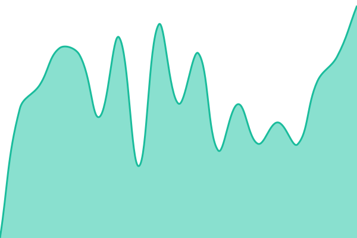
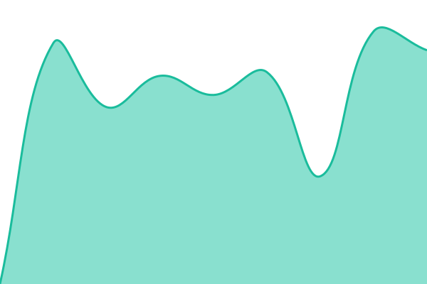
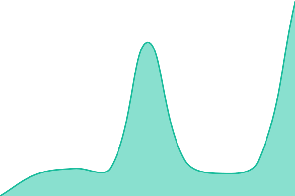
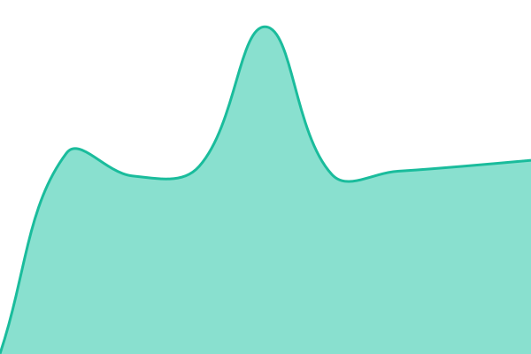

# [📈 Live Status](https://demo.upptime.js.org): <!--live status--> **🟩 All systems operational**

This repository contains the open-source uptime monitor and status page for [Upptime](https://upptime.js.org), powered by [Upptime](https://github.com/upptime/upptime).

With [Upptime](https://upptime.js.org), you can get your own unlimited and free uptime monitor and status page, powered entirely by a GitHub repository. We use [Issues](https://github.com/upptime/upptime/issues) as incident reports, [Actions](https://github.com/d-michal/upptime/actions) as uptime monitors, and [Pages](https://demo.upptime.js.org) for the status page.

<!--start: status pages-->
<!-- This summary is generated by Upptime (https://github.com/upptime/upptime) -->
<!-- Do not edit this manually, your changes will be overwritten -->
<!-- prettier-ignore -->
| URL | Status | History | Response Time | Uptime |
| --- | ------ | ------- | ------------- | ------ |
|  [Sčitanie 2021](https://gis.scitanie.sk/portal/apps/sites/#/obyvatelia) | 🟩 Up | [scitanie-2021.yml](https://github.com/d-michal/upptime/commits/HEAD/history/scitanie-2021.yml) | 

 865ms
     
 | 

<a href="https://d-michal.github.io/upptime/history/scitanie-2021">99.48%</a>
    

|  [Sčitanie 2021 - Server Health](https://gis.scitanie.sk/server/rest/info/healthcheck?f=pjson) | 🟩 Up | [scitanie-2021-server-health.yml](https://github.com/d-michal/upptime/commits/HEAD/history/scitanie-2021-server-health.yml) | 

 183ms
     
 | 

<a href="https://d-michal.github.io/upptime/history/scitanie-2021-server-health">99.49%</a>
    

|  [Sčitanie 2021 - DB Query](https://gis.scitanie.sk/server/rest/services/Hosted/obyv_roz_hustota_pocet/FeatureServer/9/query?where=1%3D1&outFields=spolu&f=json) | 🟩 Up | [scitanie-2021-db-query.yml](https://github.com/d-michal/upptime/commits/HEAD/history/scitanie-2021-db-query.yml) | 

 2527ms
     
 | 

<a href="https://d-michal.github.io/upptime/history/scitanie-2021-db-query">99.49%</a>
    

|  [Územná príprava Sčitanie 2021](https://censusup.statistics.sk/portal/home/) | 🟩 Up | [uzemna-priprava-scitanie-2021.yml](https://github.com/d-michal/upptime/commits/HEAD/history/uzemna-priprava-scitanie-2021.yml) | 

 815ms
     
 | 

<a href="https://d-michal.github.io/upptime/history/uzemna-priprava-scitanie-2021">99.50%</a>
    

|  [Mapy CDB](https://ismcs.cdb.sk/mapviewer) | 🟩 Up | [mapy-cdb.yml](https://github.com/d-michal/upptime/commits/HEAD/history/mapy-cdb.yml) | 

 849ms
     
 | 

<a href="https://d-michal.github.io/upptime/history/mapy-cdb">95.95%</a>
    

|  [MULP](https://mulp.nlcsk.org/webgiseditor) | 🟩 Up | [mulp.yml](https://github.com/d-michal/upptime/commits/HEAD/history/mulp.yml) | 

 1614ms
     
 | 

<a href="https://d-michal.github.io/upptime/history/mulp">100.00%</a>
    

|  [Portál MULP](https://mulp.nlcsk.org/portal/home/) | 🟩 Up | [portal-mulp.yml](https://github.com/d-michal/upptime/commits/HEAD/history/portal-mulp.yml) | 

 173ms
     
 | 

<a href="https://d-michal.github.io/upptime/history/portal-mulp">100.00%</a>
    

|  [Portál NLCSK](https://gis.nlcsk.org/portal/home/) | 🟩 Up | [portal-nlcsk.yml](https://github.com/d-michal/upptime/commits/HEAD/history/portal-nlcsk.yml) | 

 921ms
     
 | 

<a href="https://d-michal.github.io/upptime/history/portal-nlcsk">100.00%</a>
    

<!--end: status pages-->

[**Visit our status website →**](https://d-michal.github.io/upptime/)

## 📄 License

- Powered by: [Upptime](https://github.com/upptime/upptime)
- Code: [MIT](./LICENSE) © [Anand Chowdhary](https://anandchowdhary.com), supported by [Pabio](https://pabio.com)
- Data in the `./history` directory: [Open Database License](https://opendatacommons.org/licenses/odbl/1-0/)
